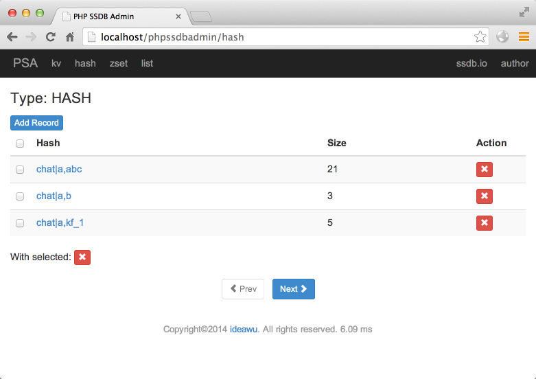

phpssdbadmin
============

## 安装

编辑 `app/config/config.conf`:

	'ssdb' => array(
		'host' => '127.0.0.1',
		'port' => '8888',
	),

将 `host` 和 `port` 修改成正确的值.

然后编辑你的 Nginx 配置文件, 加入一条 URL 重写规则:

	location /phpssdbadmin {
		try_files $uri $uri/ /phpssdbadmin/index.php?$args;
	}

如果你使用的是 Apache 的话, 自己将上面的规则改成 Apache 格式.

__注意: 如果你的 nginx.conf 没有配置 `index index.php;`, 请加上.__

### php.ini 配置

__`short_open_tag` 必须启用!__

编辑 `php.ini`, 查找 `short_open_tag`, 如果没有, 则加入下面一行, 如果有, 修改为

	short_open_tag = On

注意, 行的前面不要有分号或者其它字符!

phpssdbadmin
============

SSDB Admin Tool Built with PHP.

## Install

Edit `app/config/config.conf`:

	'ssdb' => array(
		'host' => '127.0.0.1',
		'port' => '8888',
	),

Change `host` and `port` to the right values.

Then edit your Nginx configuration, add one URL rewrite rule as:

	location /phpssdbadmin {
		try_files $uri $uri/ /phpssdbadmin/index.php?$args;
	}

__Your nginx.conf must set `index index.php`.__

### php.ini configuration

__`short_open_tag` MUST be open!__

Edit `php.ini`, find `short_open_tag`, if there is none, add the line below, if any, modify it to

	short_open_tag = On

Attention, do not put any ';' mark or any other charcters before it!

## Screeshots

